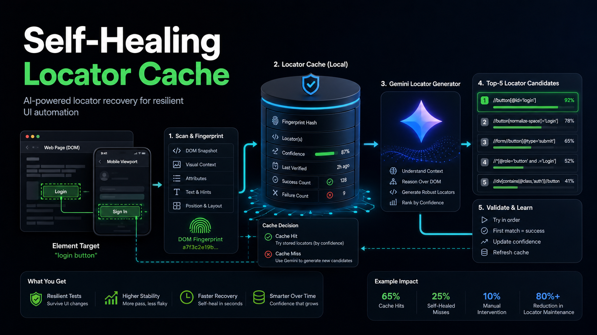
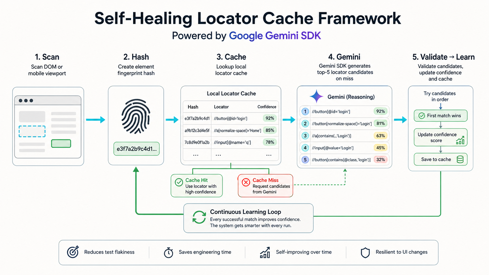

# Building a Self-Healing Locator Cache Framework with Google Gemini SDK



UI automation rarely fails because the user journey changed.

More often, it fails because a locator changed.

A CMS update renames a button id. A frontend release reshuffles markup. A client-owned website changes without warning. Suddenly, the test that was correctly trying to click **Login** is broken because `#login-button-old` no longer exists.

The flow is still valid. The locator is not.

That distinction matters.

I built a sample self-healing locator cache framework around that idea: keep the test flow unchanged, but make locator resolution adaptive. The framework uses a local cache, DOM fingerprinting, confidence metrics, and the Google Gemini SDK to generate ranked locator candidates when cached locators fail.

The sample repo is here:

https://github.com/MrNewDelhi/self-healing-locator-framework

## The Problem

In black-box testing, we often do not control the application under test.

This is especially painful for CMS-based websites where content, labels, page structure, and attributes can change without a coordinated release note for QA automation teams.

The usual result is familiar:

- scripts fail
- engineers triage screenshots and traces
- locators are repaired by hand
- the same failure pattern returns after the next CMS or frontend update

This creates a maintenance loop where the test suite becomes expensive not because the business flows are unstable, but because the element discovery strategy is brittle.

The goal of this framework is simple:

> Do not change the test flow. Only heal the locator used at that step.

## The Core Idea

Instead of hardcoding one locator and failing immediately, the framework stores a local cache of locator candidates for each target element.

Each cache entry tracks:

- target name, such as `login button`
- page key, such as `https://www.saucedemo.com/`
- stable element hash
- top locator candidates
- confidence score
- attempts
- successes
- failures
- cache hits
- cache misses
- last and average resolution time

The test does not say:

```ts
await page.locator("#login-button").click();
```

It says:

```ts
const login = await healing.find("login button", [staleLocator]);
await login.locator.click();
```

The test still clicks the login button. The difference is that locator selection becomes a runtime decision backed by evidence.

## The Gemini-Powered Pipeline



The framework follows this flow:

1. The test asks for a target element, for example `login button`.
2. The framework checks the local locator cache.
3. If cached candidates exist, it tries them in confidence order.
4. If cached locators fail, it scans the visible page.
5. It extracts DOM snapshots and stable element hashes.
6. The Google Gemini SDK receives the target name and snapshots.
7. Gemini returns the top 5 locator candidates with scores and reasons.
8. The framework validates candidates one by one in the browser.
9. The first working locator is used.
10. The cache is updated with confidence metrics.

This keeps the system grounded. Gemini suggests candidates, but the automation runtime proves whether a locator actually works.

## What Gets Scanned

For a website, the framework can scan the page DOM and collect useful element signals:

- tag name
- visible text
- role
- ARIA label
- placeholder
- test id or data-test
- id
- name
- type
- class list
- CSS path

It then creates a stable hash from the element’s shape.

The hash is not meant to be a perfect identity forever. It is a practical fingerprint that helps answer:

> Does this candidate still look like the same kind of element we previously used?

## Gemini Locator Generation

The Gemini adapter sends a compact prompt containing the target element name and visible element snapshots.

It asks Gemini to return exactly five candidates in a structured JSON contract:

```ts
[
  {
    strategy: "role",
    value: "button",
    name: "Login",
    score: 0.91,
    reason: "Accessible role matched the target intent."
  },
  {
    strategy: "css",
    value: "#login-button",
    score: 0.88,
    reason: "Element id was present in the scanned component."
  }
]
```

That contract is the important part.

The framework does not blindly trust a model response. It loops over candidates, materializes each locator in Playwright, waits for visibility, and only persists the locator that works.

## Confidence Metrics

A self-healing cache should not be just a drawer full of strings.

It should behave like evidence.

When a locator works, confidence increases. When a cached locator fails, confidence decreases. Cache hits and misses are tracked separately so teams can see whether the system is genuinely reducing maintenance.

Useful metrics include:

- cache hit rate
- healed miss rate
- manual triage rate
- average resolution time
- locator confidence by target
- most unstable pages
- most frequently healed elements

Example resolution outcomes:

- Cache hits: 65%
- Healed misses: 25%
- Manual triage: 10%

Over time, this tells you whether your test suite is becoming more resilient or merely hiding flaky behavior.

## Cache Hit and Miss Logic

The cache logic is intentionally conservative.

On a cache hit:

- load cached candidates
- try the highest-confidence candidate first
- if it works, increase confidence
- if it fails, record a miss and ask Gemini for fresh candidates

On a cache miss:

- scan visible elements
- send snapshots to Gemini
- generate locator candidates
- validate them one by one
- store the winning candidate
- persist the updated cache locally

Every healed locator can be traced back to the candidates that were tried and the reason the selected candidate won.

## Why This Helps

The biggest benefit is not that tests magically never fail.

They still should fail when the product flow is broken.

The benefit is that tests do not fail just because a locator became stale while the user journey remained valid.

This reduces:

- repetitive locator triage
- manual maintenance after CMS changes
- noisy failures in CI
- time spent inspecting screenshots for obvious locator drift

It also gives QA and engineering teams a better signal:

> Did the feature break, or did the locator break?

Those are very different problems.

## Web vs Android and iOS

The web case is the easiest version of this idea.

On a website, the whole page DOM can usually be scanned. That means the framework can inspect many possible candidates at once.

Mobile is different.

With Android and iOS automation through Appium, the accessibility tree generally exposes what is available in the current viewport. If an element is off-screen, inside a collapsed panel, or behind a navigation step, it will not be discovered until the app reaches that state.

For mobile, the same methodology still works, but the scan strategy changes:

- scan the current viewport
- scroll in controlled chunks
- collect accessibility snapshots
- ask Gemini for candidates per viewport
- only heal the locator for the intended step
- do not change the test flow automatically

That last point is important.

A self-healing locator system should not invent a new journey through the app. It should only help find the intended element when the test flow is already at the correct step.

## Running the Sample

The repo uses Playwright and Sauce Demo as the sample website.

Install dependencies:

```bash
npm install
npx playwright install chromium
```

Set your Gemini key:

```bash
export GEMINI_API_KEY="your-key"
```

Run tests:

```bash
npm test
```

Run the standalone demo:

```bash
npm run demo
```

The demo intentionally starts with a stale locator:

```ts
const brokenSeed = {
  strategy: "css",
  value: "#login-button-before-cms-redesign",
  score: 0.2,
  reason: "Simulates a stale locator left behind after an unannounced page change."
};
```

The framework scans the page, asks Gemini for replacement candidates when needed, clicks the login button, and updates the local cache.

Example result:

```json
{
  "target": "login button",
  "cacheHit": false,
  "healed": true,
  "selectedLocator": {
    "strategy": "css",
    "value": "#login-button",
    "score": 0.92,
    "reason": "Element id was present in the scanned component."
  },
  "confidence": 0.93,
  "attempted": 3
}
```

## Final Thoughts

Self-healing locators are not a replacement for good test design.

They are a maintenance layer.

The framework should not hide real product defects, skip failed assertions, or invent new flows. It should simply recognize when the target element is still present but the old locator is stale.

For black-box testing, client-owned products, CMS-driven pages, and large automation suites, that can remove a lot of repetitive triage work.

The practical win is flexibility without losing control:

- the test flow stays readable
- the locator strategy becomes adaptive
- confidence metrics make healing observable
- failures remain explainable

That is the kind of automation resilience worth building.
