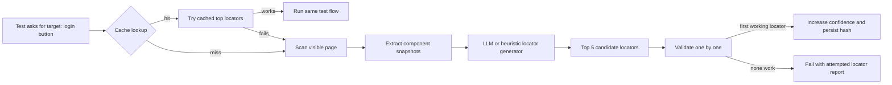
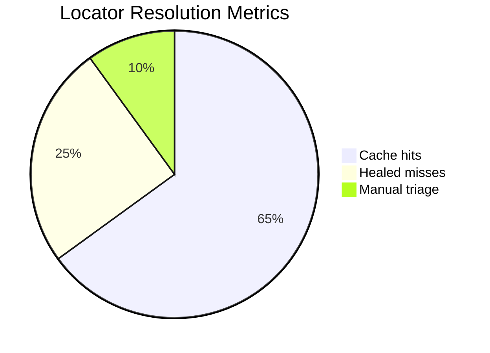

# Self-Healing Locator Framework

This repo demonstrates a self-healing locator methodology for black-box UI automation. The sample is intentionally simple: it runs against [Sauce Demo](https://www.saucedemo.com/), starts with a broken login-button locator, scans the page, generates the top 5 replacement locator candidates, validates them in order, and updates a local cache with confidence metrics.

The idea is framework-agnostic. Playwright is used here because it is fast to test on a website, but the same pattern can sit in Selenium, Cypress, WebdriverIO, Appium, or an internal QA runner.

## Problem Scenario

In CMS-driven websites and client-owned black-box products, element changes often arrive without warning. A client changes a button id, reshuffles markup, or updates text in the CMS. The test flow is still correct, but the locator breaks. Teams then spend a large chunk of triage time maintaining locators by hand.

This framework does not change the automation flow. It only changes how the target element is found.

## Pipeline



## Cache Model

Each cache entry maps:

- target name, for example `login button`
- page key, for example `https://www.saucedemo.com/`
- element hash derived from stable element shape
- top 5 candidate locators
- confidence score
- attempts, successes, failures, cache hits, cache misses
- last and average resolution time

Confidence rises when a locator works and drops when a cached locator fails. This creates practical metrics instead of a binary pass/fail locator store.



## Web vs Mobile Reality

For websites, the whole page DOM can be scanned and ranked. For Android and iOS through Appium, the accessibility tree is usually limited to the current viewport. If the target element is below the fold or inside an unopened screen, it will not be detected until the automation scrolls or navigates there.

Recommended mobile adaptation:

- scan current viewport
- scroll in controlled chunks
- collect visible accessibility snapshots
- generate candidate locators per viewport
- never change the test flow, only replace the locator used at the intended step

## Run It

```bash
npm install
npx playwright install chromium
npm test
npm run demo
```

The demo writes `.locator-cache.json` locally. Delete it whenever you want to simulate a cold start.

## Optional LLM Integration

`src/llm/HeuristicLocatorGenerator.ts` is intentionally shaped like an LLM adapter. Replace it with a provider that sends:

- the target element name
- visible component snapshots
- current page metadata
- historical cache confidence

The provider should return exactly the same `LocatorCandidate[]` contract:

```ts
[
  { strategy: "role", value: "button", name: "Login", score: 0.91, reason: "Accessible role match" },
  { strategy: "testId", value: "login-button", score: 0.88, reason: "Stable data-test hook" }
]
```

## Repository Layout

```text
src/
  cache/LocatorCache.ts
  dom/fingerprint.ts
  dom/scanPage.ts
  llm/HeuristicLocatorGenerator.ts
  SelfHealingLocator.ts
tests/
  self-healing.spec.ts
tutorial/
  index.html
  DESIGN.md
```

## Tutorial Video

The HyperFrames tutorial source lives in `tutorial/`. After dependencies are installed:

```bash
npm run hyperframes:lint
npm run hyperframes:inspect
npm run hyperframes:render
```

The video explains the black-box testing problem, cache hit/miss logic, confidence metrics, and the key web-versus-mobile limitation.
