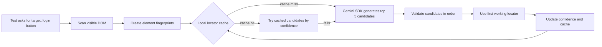

# Self-Healing Locator Cache with Google Gemini SDK

This repo demonstrates a self-healing locator cache framework for black-box UI automation. It uses Playwright for the sample website, a local JSON cache for learned locators, DOM fingerprinting for element identity, confidence metrics for observability, and the Google Gemini SDK to generate ranked locator candidates when cached locators fail.


## Problem Scenario

In CMS-driven websites and client-owned black-box products, element changes often arrive without warning. A client changes a button id, reshuffles markup, or updates text in the CMS. The test flow is still correct, but the locator breaks. Teams then spend a large chunk of triage time maintaining locators by hand.

This framework does not change the automation flow. It only changes how the target element is found.

## How It Works



The sample run starts with a broken locator, scans [Sauce Demo](https://www.saucedemo.com/), asks Gemini for locator candidates when needed, validates candidates one by one, then stores the winning locator locally.

## Cache Model

Each cache entry maps:

- target name, for example `login button`
- page key, for example `https://www.saucedemo.com/`
- element hash derived from stable element shape
- top 5 locator candidates
- confidence score
- attempts, successes, failures, cache hits, cache misses
- last and average resolution time

Confidence rises when a locator works and drops when a cached locator fails. This creates practical metrics instead of a binary pass/fail locator store.


## Gemini SDK Integration

The Gemini adapter lives in [src/gemini/GeminiLocatorGenerator.ts](src/gemini/GeminiLocatorGenerator.ts).

It sends Gemini:

- target element name
- visible DOM/accessibility snapshots
- stable element hashes
- role, text, label, placeholder, id, test id, class, and CSS-path signals

Gemini returns the top 5 candidates in this contract:

```ts
[
  {
    strategy: "role",
    value: "button",
    name: "Login",
    score: 0.91,
    reason: "Accessible role matched the target intent."
  },
  {
    strategy: "css",
    value: "#login-button",
    score: 0.88,
    reason: "Element id was present in the scanned component."
  }
]
```

The framework then validates candidates in the browser. Gemini suggests; the automation runtime proves.

## Run It

```bash
npm install
npx playwright install chromium
export GEMINI_API_KEY="your-key"
npm test
npm run demo
```

If `GEMINI_API_KEY` is not present, the demo uses a deterministic local fallback so the repository remains runnable in CI. Production usage should set `GEMINI_API_KEY` or `GOOGLE_API_KEY`.

The demo writes `.locator-cache.json` locally. Delete it whenever you want to simulate a cold start.

## Web vs Mobile Reality

For websites, the whole page DOM can be scanned and ranked. For Android and iOS through Appium, the accessibility tree is usually limited to the current viewport. If the target element is below the fold or inside an unopened screen, it will not be detected until the automation scrolls or navigates there.

Recommended mobile adaptation:

- scan current viewport
- scroll in controlled chunks
- collect visible accessibility snapshots
- ask Gemini for candidates per viewport
- never change the test flow, only replace the locator used at the intended step

## Repository Layout

```text
src/
  cache/LocatorCache.ts
  dom/fingerprint.ts
  dom/scanPage.ts
  gemini/GeminiLocatorGenerator.ts
  SelfHealingLocator.ts
tests/
  self-healing.spec.ts
assets/
  medium/story-header.png
  medium/locator-cache-architecture.png
```

## Validation

```bash
npm run typecheck
npm test
npm run demo
```

The Playwright tests verify both a healed stale locator and a second lookup that uses the cache and raises confidence.
